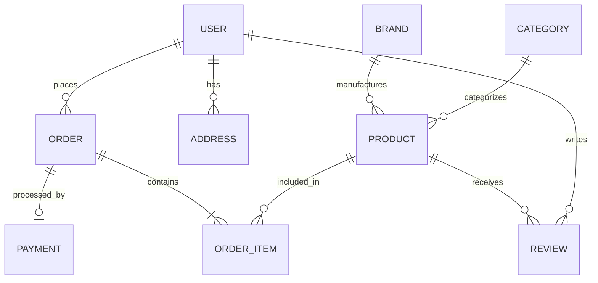

# Architecture Diagram

```mermaid
graph TD
    Client[Web Browser] --> |HTTP/HTTPS| Frontend[React + Vite (Customer & Admin)]
    Frontend --> |REST API| Backend[Node.js + Express.js]
    Backend --> |Mongoose| MongoDB[(MongoDB Atlas)]
    Backend --> |SDK| Cloudinary[Cloudinary DAM]
    Backend --> |SDK| Stripe[Stripe Payment Gateway]
    Backend --> |SDK| Razorpay[Razorpay Payment Gateway]
```

## Entity Relationship Diagram


